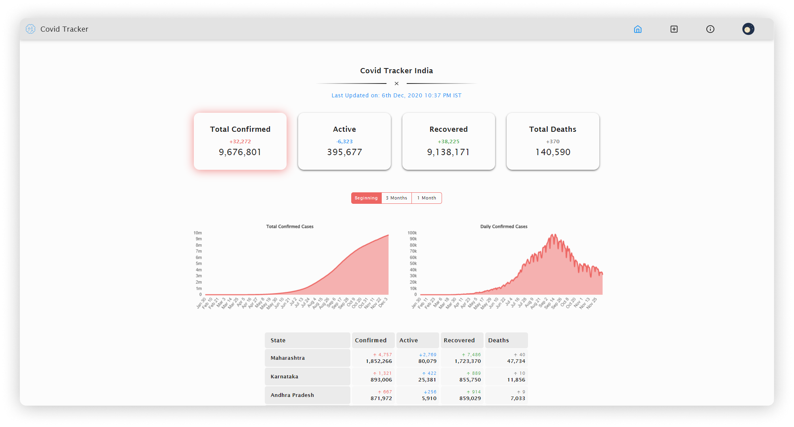
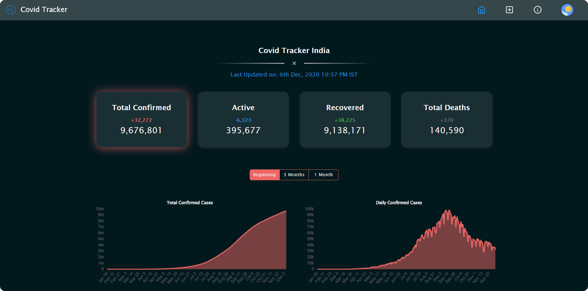

## Covid Tracker India

---

   

      [](https://hits.seeyoufarm.com)





### Introduction

**Covid Tracker India** is a statistical and data tracking project which aims at tracking the Covid-19 pandemic in India. This project gets the fresh JSON data collected from multiple sources and shows it in a meaningful way. The data is compiled for use accordingly. The current data shown as card of total and daily cases for confirmed, active, recovered and death due to Covid-19. These cards are clickable entities which when clicked switches the graph mode. The graphical representation of these data is done using a Line Chart. This chart shows the data from the beginning of the pandemic. There is an option to adjust this time frame to draw the graph for last 3 months or last 1 month. This line cart helps in better understanding of the Covid19 impact in India in recent times.

The state wise data is also listed in a form of table which shows the total and daily cases of covid-19 in a state or union territory. The table also shows the change in the number of cases from the day before. If the overall cases increases it shows the number with an up arrow, else it shows it with a down arrow. These depiction helps to identify the current increase or decrease of the covid-19 cases in any state or union territory.

This project also shows the data about the upcoming vaccines and their current status. The vaccine status is shown in a bar chart. More details on each vaccine is provided below the chart.

The project comes with an inbuilt dark mode, which can be turned on easily using the switch on the top right corner of the screen. If you are using a mobile, open the hamburger menu to switch between dark mode and light mode.

### Motivation

Covid-19 Pandemic affects us all. Today it's someone else who is getting infected; tomorrow it could be us. We need to prevent the spread of this virus. These statistical representations helps spread awareness of Covid-19. Please follow the Government guidelines to minimize the spread of this virus. Lets be responsible around everyone and in social areas. Please maintain social distancing. Avoid social gathering. Keep 6ft, distance from people 🧍↔️🧍. Always remember to wash your hands regularly with soap 🧼👏. Always wear a mask 😷. Try not to touch your face 🚫🤦.

### Sources

-   This project collects the daily and total data from the APIs exposed by [Covid19India Team](https://api.covid19india.org/).
-   This project get the vaccine data from [disease.sh](https://disease.sh/) via RAPS (Regulatory Affairs Professional Society).

### Build

Use the below commands to get started.

```sh
yarn install
yarn start
```

### Contribution

This project is an open-sourced react project hosted on github. Feel free to create any issues in the repository and get started with any bugs fixes, features and enhancements. Please fork the repository and work on the changes. Once the changes are done, please create a Pull Request with the master branch. If the changes are satisfactory then the branch can be merged. Any push to the master branch will then trigger the deployment action using github actions. This will automatically install, build and deploy the changes to the `gh-pages` branch. 🚀😎

### License


Usage is provided under the [MIT License](./LICENSE). See LICENSE for the full details.
